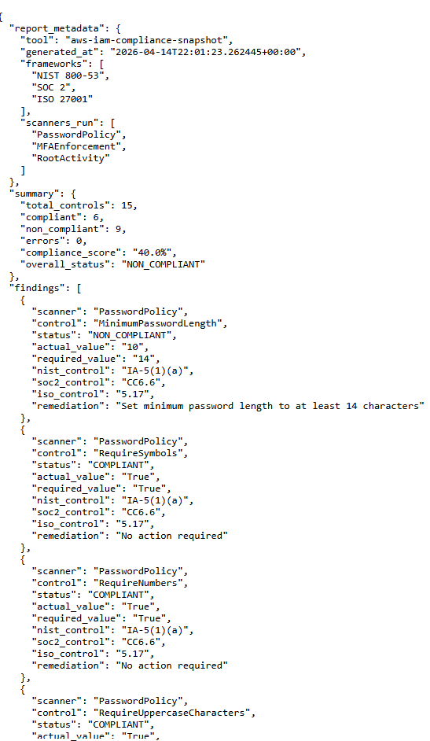
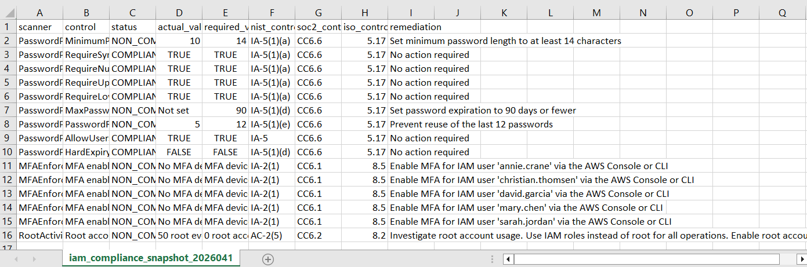

# AWS IAM Compliance Scanner

Automated IAM compliance scanner that checks three security controls in one run and produces audit-ready evidence mapped to NIST 800-53, SOC 2, and ISO 27001.

---

## What this project does

Most compliance teams check IAM controls manually by logging into the console, reviewing settings one by one, and copying findings into a spreadsheet. This project automates that entire process.

A Lambda function runs on a schedule, scans three IAM controls, and uploads JSON and CSV compliance reports directly to S3. No manual steps. No console access required after deployment.

---

## Skills demonstrated

| Area | Description |
|---|---|
| GRC Automation | Automated three IAM compliance controls with structured evidence output |
| Framework Alignment | Mapped findings to NIST 800-53, SOC 2, and ISO 27001 |
| Serverless Architecture | Deployed scheduled Lambda with EventBridge trigger |
| Infrastructure as Code | Defined all AWS resources in a CloudFormation template |
| Least Privilege IAM | Lambda role scoped to only required read permissions |
| Evidence Generation | Produced JSON and CSV audit-ready reports automatically |

---

## The three controls it checks

| Scanner | What it checks | Why it matters |
|---|---|---|
| **Password Policy** | Evaluates 9 IAM password settings against hardened baselines | Weak password policies are one of the most common audit findings |
| **MFA Enforcement** | Checks every console user for an active MFA device | Accounts without MFA are a leading cause of cloud breaches |
| **Root Account Activity** | Searches CloudTrail for root login events in the last 30 days | Root usage bypasses all IAM controls, so it should never appear in logs |

---

## Compliance framework mapping

Every finding is mapped to the relevant control in each framework.

| Control Area | NIST 800-53 | SOC 2 | ISO 27001 |
|---|---|---|---|
| Password complexity & rotation | IA-5(1) | CC6.6 | 5.17 (Authentication Information) |
| MFA for console access | IA-2(1) | CC6.1 | 8.5 (Secure Auth) |
| Root account restrictions | AC-2(5) | CC6.2 | 8.2 (Privileged Access) |

---

## Architecture

```
CloudFormation (one-time deployment)
   creates → IAM Role
   creates → Lambda Function
   creates → EventBridge Rule
   creates → S3 Bucket configuration

                    ↓ after deployment

EventBridge (every 7 days)
        ↓
   Lambda Function
        ↓
  ┌─────────────────────────────┐
  │  Scanner 1: Password Policy │  → IAM API
  │  Scanner 2: MFA Enforcement │  → IAM API
  │  Scanner 3: Root Activity   │  → CloudTrail API
  └─────────────────────────────┘
        ↓
   S3 Bucket
   ├── report.json  (automation + audit trail)
   └── report.csv   (human review + stakeholder reporting)
```

---

## Prerequisites

Before you start, make sure you have:

- An AWS account
- AWS CLI installed and configured (`aws configure sso` or `aws configure`)
- Python 3.12 or higher
- Your AWS profile name ready (you will use it in the deployment steps)

---

## Cost

This project runs entirely within the AWS Free Tier.

| Resource | Free Tier coverage | Estimated monthly cost |
| --- | --- | --- |
| Lambda invocations | 1M requests / 400,000 GB-seconds free | $0 |
| EventBridge rules | First scheduled rule is free | $0 |
| S3 storage | 5 GB standard storage free | $0 |
| CloudTrail LookupEvents | Free for management events | $0 |
| CloudWatch Logs | 5 GB ingestion free | $0 |

At the default 7-day schedule, total monthly cost is **$0** for accounts within free tier limits. Even outside free tier, expected cost is under $0.10/month.

---

## Deployment

### Step 1: Clone the repo

```bash
git clone https://github.com/angie-in-the-cloud/aws-iam-compliance-scanner.git
cd aws-iam-compliance-scanner
```

### Step 2: Package the Lambda source code

The Lambda function runs from a ZIP file. Package it like this:

```bash
cd src
zip -r ../lambda-source.zip .
cd ..
```

### Step 3: Create your S3 bucket

This bucket stores your compliance reports. Bucket names must be globally unique, so replace the name below with your own.

```bash
aws s3 mb s3://your-iam-scanner-bucket --region us-east-1 --profile your-profile-name
```

### Step 4: Upload the Lambda ZIP to S3

```bash
aws s3 cp lambda-source.zip s3://your-iam-scanner-bucket/source/lambda-source.zip --profile your-profile-name
```

### Step 5: Deploy the CloudFormation stack

```bash
aws cloudformation deploy \
  --stack-name iam-compliance-scanner \
  --template-file templates/cloudformation.yaml \
  --capabilities CAPABILITY_NAMED_IAM \
  --parameter-overrides S3BucketName=your-iam-scanner-bucket \
  --region us-east-1 \
  --profile your-profile-name
```

You should see this in your terminal when it completes:

```
Successfully created/updated stack - iam-compliance-scanner
```

### Step 6: Load your Python code into Lambda

When CloudFormation deployed your Lambda function in Step 5, it created a shell (the function exists but only has a placeholder inside it, not your actual scanner code).
In Step 4 you uploaded your ZIP file to S3. Now you're telling Lambda to go grab it from there and load it in.

```bash
aws lambda update-function-code \
  --function-name iam-compliance-scanner \
  --s3-bucket your-iam-scanner-bucket \
  --s3-key source/lambda-source.zip \
  --region us-east-1 \
  --profile your-profile-name
```

What each flag means:

| Flag | What it does |
|---|---|
| `--function-name` | The name of the Lambda function CloudFormation created |
| `--s3-bucket` | The bucket where your ZIP file is sitting |
| `--s3-key` | The path to the ZIP file inside the bucket |
| `--region` | The AWS region where your Lambda lives |
| `--profile` | Your AWS CLI profile |

After this runs, your Lambda contains your real scanner code and is ready to use.

### Step 7: Run the scan manually

Test it before waiting for the schedule to trigger it:

```bash
aws lambda invoke \
  --function-name iam-compliance-scanner \
  --region us-east-1 \
  --profile your-profile-name \
  --cli-read-timeout 300 \
  response.json
```

Check `response.json` for the output summary. A successful run looks like:

```json
{
  "statusCode": 200,
  "message": "IAM Compliance Scan complete",
  "findings_count": 15,
  "compliant": 6,
  "non_compliant": 9
}
```

### Step 8: Check S3 for your reports

```bash
aws s3 ls s3://your-iam-scanner-bucket/reports/ --profile your-profile-name
```

Download the CSV to review findings:

```bash
aws s3 cp s3://your-iam-scanner-bucket/reports/iam_compliance_scan_<timestamp>.csv . --profile your-profile-name
```

---

## Report output

After the Lambda runs, two files appear in your S3 bucket.

**JSON report** - structured data for automation and audit trails


     
**CSV report** - one row per control, ready for review or import into a GRC tool



---

## How the schedule works

The schedule is set in the CloudFormation template. To change it, update the `ScheduleExpression` parameter and redeploy the stack.

By default the scan runs every 7 days. EventBridge triggers the Lambda automatically, no manual intervention needed after deployment.

To change the schedule, update the `ScheduleExpression` parameter when deploying:

```bash
# Run daily
--parameter-overrides ScheduleExpression="rate(1 day)"

# Run monthly
--parameter-overrides ScheduleExpression="rate(30 days)"
```

---

## IAM permissions

The Lambda role follows least privilege. It only has the permissions it needs:

| Permission | Why it's needed |
|---|---|
| `iam:GetAccountPasswordPolicy` | Reads the account password policy |
| `iam:ListUsers` | Gets the list of IAM users |
| `iam:GetLoginProfile` | Checks which users have console access |
| `iam:ListMFADevices` | Checks MFA status per user |
| `cloudtrail:LookupEvents` | Searches for root account events |
| `s3:PutObject` | Uploads reports to the S3 bucket |
| `logs:*` | Writes Lambda execution logs to CloudWatch |

---

## Limitations

This is intentionally a focused scanner, not a full IAM posture tool. Out of scope for this version:

| Limitation | Why it matters |
| --- | --- |
| Single account only | Does not assume cross-account roles or scan an AWS Organization |
| Console users only | Does not separately analyze federated/SSO users or service accounts |
| No policy analysis | Does not evaluate IAM policies for over-permissive grants, wildcard actions, or unused permissions |
| Last 30 days only | Root account check uses a 30-day CloudTrail lookback to stay within `LookupEvents` rate limits |
| Snapshot in time | Each run is a point-in-time check, not continuous monitoring |

---

## Cleanup

To remove all resources created by this project:

```bash
# Empty the S3 bucket first (required before stack deletion)
aws s3 rm s3://your-iam-scanner-bucket --recursive --profile your-profile-name

# Delete the CloudFormation stack
aws cloudformation delete-stack \
  --stack-name iam-compliance-scanner \
  --region us-east-1 \
  --profile your-profile-name
```

---

## Resources

- [AWS IAM Password Policy documentation](https://docs.aws.amazon.com/IAM/latest/UserGuide/id_credentials_passwords_account-policy.html)
- [AWS CloudTrail LookupEvents](https://docs.aws.amazon.com/awscloudtrail/latest/APIReference/API_LookupEvents.html)
- [NIST 800-53 IA Control Family](https://csrc.nist.gov/projects/cprt/catalog#/cprt/framework/version/SP_800_53_5_1_0/home)
- [AWS CLI Reference](https://docs.aws.amazon.com/cli/latest/reference/)

---
